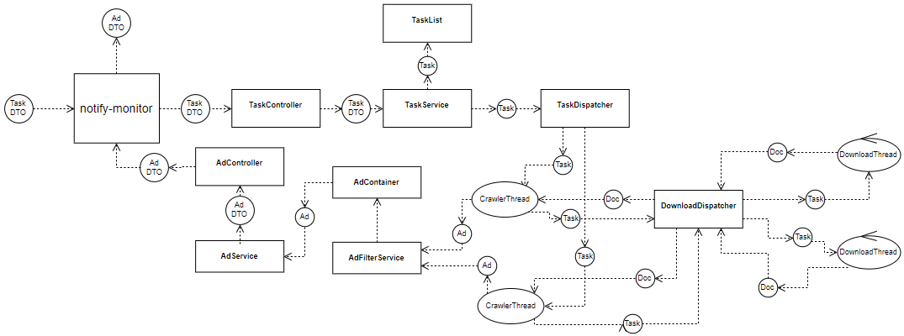

## notify-monitor [](https://codecov.io/gh/tscript3r/notify-monitor) [](https://circleci.com/gh/tscript3r/notify-monitor)

REST API to receive new added ads - it is basically a crawler, 
which is refreshing given URL and looking for new added content.

### Table of Contents
* [General info](#general-info)
* [Technologies](#technologies)
* [Supported services](#supported-services)
* [Running notify-monitor locally](#running-notify-monitor-locally)
* [Process flow diagram](#process-flow-diagram)
* [Usage example](#usage-example)

#### General info
Did you ever wanted to be as soon as possible be informed about 
lets say an new added car with an good price to an advertising service, 
so that no one will be quicker than you? Or are you tired to checkout
every ad services for what you are looking for? That is why I created 
this API. This service is designed to collect only the new ads and
return it to the client when he asks for them.

#### Technologies
* Java 1.8
* Multithreaded
* Spring Boot 2.1.3
* Spring MVC
* Spring Actuator
* Spring Devtools
* MapStruct 1.2.0
* Swagger 2.7.0
* Jsoup 1.7.2
* Mockito 2.23.4
* JUnit 4

#### Supported services
##### Currently:
* OLX.pl
##### Near future:
* Allegro.pl
* OTODom.pl
* OTOMoto.pl
* KupBilecik.pl
####

#### Running notify-monitor locally
```
git clone https://github.com/tscript3r/notify-monitor.git
cd notify-monitor
./mvnw package
java -jar target/*.jar
```

#### Process flow diagram


#### Usage example
First of all you will need to add an task - to do that:
```
curl -X POST -H "Content-Type: application/json" -d '{"url":"https://www.olx.pl/motoryzacja/samochody/wroclaw/", "users_id": [1, 2]}' localhost:8080/api/v1/tasks/
```
Response example:
```
{
    "id": 3,
    "url": "https://www.olx.pl/motoryzacja/samochody/wroclaw/",
    "users_id": [
        1,
        2
    ],
    "refresh_interval": 120,
    "stored_ads_limit": 50
}

```
Any returned ad will have the 'users_id' values to identify the task owner users.
This fields are of course mandatory. You can additionally add the 'refresh_interval' 
and 'stored_ads_limit' values - for more information please refer to the documentation.
In the near future I have planned to add feature which will auto-send the found ads to 
the given url, so there will be an additional field: "return_url".
For now to receive the new found ads:
```
curl -X GET -H localhost:8080/api/v1/tasks/1/ads
```
Response example:
```
{
    "ads": [
        {
            "id": 117,
            "url": "https://www.olx.pl/oferta/super-tania-fura-.html#38b636e8a1",
            "timestamp": "2019-03-21T14:39:41.570+0000",
            "users_id": [
                1,
                2
            ],
            "additional_properties": {
                "location": "Jaworzno",
                "title": "Super fura",
                "category": "Motoryzacja » Samochody osobowe",
                "price": "499 zł"
            }
        }
    ]
```