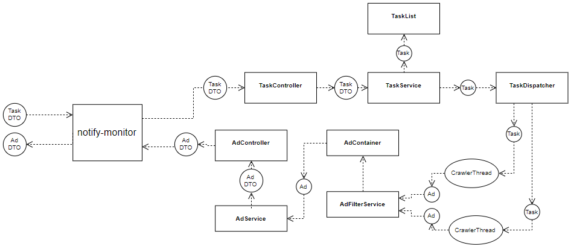

## notify-monitor [](https://codecov.io/gh/tscript3r/notify-monitor) [](https://circleci.com/gh/tscript3r/notify-monitor) [](https://www.codacy.com/app/tscript3r/notify-monitor?utm_source=github.com&amp;utm_medium=referral&amp;utm_content=tscript3r/notify-monitor&amp;utm_campaign=Badge_Grade)

REST API to receive new added ads - it is basically a crawler, 
which is refreshing given URL and looking for new added content.

### Table of Contents
*    [General info](#general-info)
*    [Technologies](#technologies)
*    [Supported services](#supported-services)
*    [Running notify-monitor locally](#running-notify-monitor-locally)
*    [Process flow diagram](#process-flow-diagram)
*    [Usage example](#usage-example)
*    [Adding new ad service](#adding-new-ad-service)

#### General info
Did you ever wanted to be as soon as possible be informed about 
lets say an new added car with an good price on an advertising service, 
so that no one will be quicker than you? Or are you tired to checkout
every ad services for what you are looking for? That is why I created 
this API. This service is designed to collect only the new ads and
return them to the client when he asks for them.

#### Technologies
*    Java 1.8
*    Multithreaded
*    Spring Boot 2.1.3
*    Spring MVC
*    Spring Actuator
*    Spring Devtools
*    MapStruct 1.2.0
*    Swagger 2.7.0
*    Jsoup 1.7.2
*    Mockito 2.23.4
*    JUnit 4

#### Supported services
##### Currently:
*    OLX.pl
*    OTOMoto.pl
*    OTODom.pl
*    KupBilecik.pl
*    HLTV.org
##### Near future:
*    Allegro.pl

#### Running notify-monitor locally
```
git clone https://github.com/tscript3r/notify-monitor.git
cd notify-monitor
./mvnw package
java -jar target/*.jar
```

#### Process flow diagram


#### Usage example
First of all you will need to add an task - to do that:

```
curl -X POST -H "Content-Type: application/json" -d '{"url":"https://www.olx.pl/motoryzacja/y/wroclaw/", "users_id": [1, 2]}' localhost:8080/api/v1/tasks/
```

Response example:

```
{
    "id": 3,
    "url": "https://www.olx.pl/motoryzacja/y/wroclaw/",
    "users_id": [
        1,
        2
    ],
    "refresh_interval": 120
}
```

Any returned ad will have the 'users_id' values to identify the task owner users.
This field and the 'url' are of course mandatory by adding new task. You can 
additionally add the 'refresh_interval' value - it is basically time interval 
between refresh iterations of the given task.


Additionally I have added filters, so that you can set it on any property. 
There are four types of filters:
*    match - selected property value has to be equal to given value
*    include - selected property value has to contain given value
*    exclude - oppositely to include filter
*    regex - given regular expression has to match to the property value

Example task adding with filter:
```
{
    "url": "https://www.olx.pl/motoryzacja/samochody/", 
    "users_id": [1, 2]
    "filters": [
        {
        	"filter_type": "exclude",
        	"property": "title",
        	"case_sensitive": false,
        	"words": [
        		"kia",
        		"honda"
        	]
        }
    ]
}
```

In the near future I have planned to add feature which will auto-send the found ads to 
the given url, so there will be an additional field: 'return_url'.
For now to receive the new found ads:

```
curl -X GET localhost:8080/api/v1/tasks/1/ads
```

Response example:

```
{
    "ads": [
        {
            "id": 117,
            "url": "https://www.olx.pl/oferta/super-tania-fura-.html#38b636e8a1",
            "timestamp": "2019-03-21T14:39:41.570+0000",
            "users_id": [
                1,
                2
            ],
            "additional_properties": {
                "location": "Jaworzno",
                "title": "Super fura",
                "category": "Motoryzacja » Samochody osobowe",
                "price": "499 zł"
            }
        }
    ]
}
```

#### Adding new ad service
Adding an new crawler for an web ad service is very simple - simply create an new 
java class at package: pl.tscript3r.monitor.crawlers with the following name pattern:
*Crawler.java, for example: SuperServiceCrawler.java, and after that:
*    implement the Crawler interface
*    make the class package private
*    annotate with @Component and @Scope("prototype")
*    equals and hashCode has to use only with his handled hostname in the following format: 
"superservice.com"

And that is it - your crawler implementation class will be automatically indexed by 
CrawlerFactory and the app will now be able to handle your implemented web service. 
For more information refer to the Crawler interface docs, and to the package-info in 
crawlers package, you can also check existing implementations for usage example.